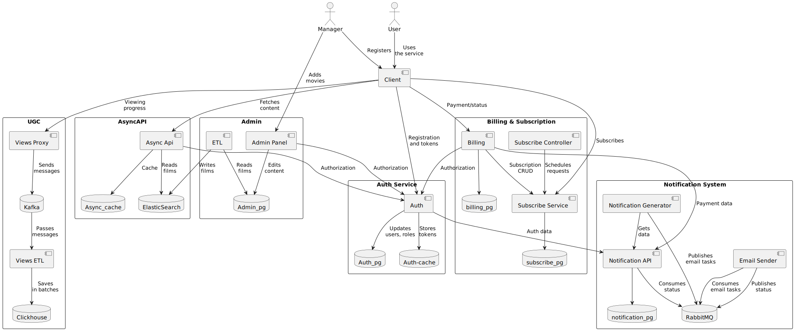

# Online Cinema Platform
## Subscription-Based Streaming Service

### Project Overview
A robust backend system for a subscription-based online cinema platform, featuring comprehensive content management, secure authentication, and automated billing processes. The project demonstrates advanced microservices architecture implementation with a focus on scalability and maintainability.

[Repository](https://github.com/sendhello/Cinema-Online)

### Key Features
- **Content Management**
  - Advanced movie catalog management
  - Elasticsearch integration for fast search
  - Comprehensive admin panel
  - Genre and movie categorization

- **User Management**
  - Google account authentication
  - Personal cabinet functionality
  - Secure user data handling
  - Role-based access control

- **Subscription & Billing**
  - Automated subscription management
  - Yandex Kassa integration
  - Payment gateway processing
  - Automatic renewal/termination

- **Notification System**
  - Real-time email notifications
  - Subscription status updates
  - Payment confirmations
  - System alerts

### Technical Stack
- **Backend**
  - Python
  - Async API
  - Microservices Architecture
  - RESTful API Design

- **Data Storage**
  - PostgreSQL
  - Elasticsearch
  - SQLite (legacy data)

- **DevOps & Monitoring**
  - Docker
  - Jaeger (distributed tracing)
  - Kibana (logging)
  - CI/CD Pipeline

### Architecture Components
1. **Admin Panel**
   - Movie catalog management
   - User management
   - System monitoring

2. **Async API**
   - High-performance endpoints
   - Request handling
   - Data validation

3. **Auth Service**
   - Google authentication
   - Session management
   - Security protocols

4. **Subscription Services**
   - Subscribe Service
   - Subscribe Controller
   - Payment processing

5. **Notification System**
   - Notification API
   - Notification Generator
   - Email Sender

6. **Data Management**
   - ETL processes
   - SQLite to PostgreSQL migration
   - Data transformation

### Project Highlights
- Scalable microservices architecture
- High-performance search capabilities
- Secure payment processing
- Real-time notification system
- Comprehensive monitoring
- Automated testing suite

### Technical Achievements
- Successfully migrated from SQLite to PostgreSQL
- Implemented distributed tracing
- Integrated multiple payment gateways
- Developed automated testing framework
- Achieved high system reliability
- Implemented comprehensive logging

### Development Process
- Version control with Git
- Docker containerization
- Automated testing
- Continuous integration
- Code quality checks
- Documentation maintenance

### Future Scalability
- Extensible architecture
- Support for additional payment gateways
- Expandable notification system
- Scalable data storage
- Modular service design

---
*Developed by: Ivan Bazhenov*
*GitHub: [@sendhello](https://github.com/sendhello)*